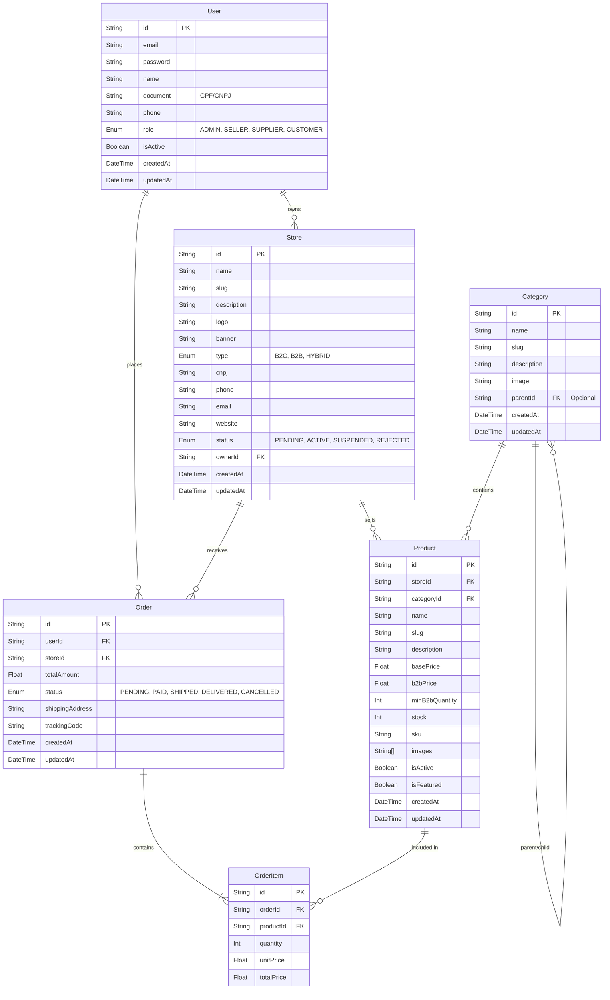

# Diagrama Entidade-Relacionamento (Conecta Market)

Este documento contém o modelo de dados da plataforma, descrevendo a estrutura relacional do banco de dados PostgreSQL utilizando Prisma.

## Diagrama ER (Mermaid)

## Prisma Schema (Referência)

O banco de dados é gerido via Prisma. Para visualizar o schema completo, consulte o arquivo `apps/api/prisma/schema.prisma`.
